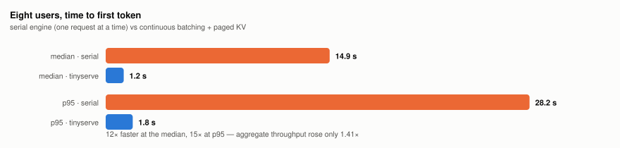
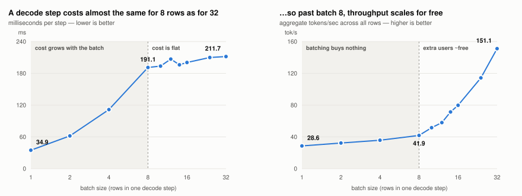

# tinyserve

A readable LLM serving engine that runs on an 8 GB M1 MacBook Air.

Not a fast one. A readable one — written to find out what **continuous
batching** and **PagedAttention** actually are, by building them from
scratch on a laptop and measuring what they do.

~1,500 lines of Python. No CUDA, no Triton, no tensor parallelism. One
chip, 8 GB of unified memory, and a fan that doesn't exist.

---

## The question this answers

A 1.5B model reads roughly a gigabyte of weights out of memory to produce
**one token**. That read dominates everything: decoding is memory-bandwidth
bound, not compute bound. Which leads to the question the whole project
exists to answer:

> If the expensive part is reading the weights, and that read is the same
> whether you serve one user or eight — can one laptop serve eight people
> almost as fast as it serves one?

That is what a real serving engine (vLLM, TGI, llm-d) is *for*. This repo
builds a small honest version of one to find out where the claim holds and
where it breaks on hardware this size.

## What it is

An OpenAI-compatible HTTP server around **Qwen2.5-1.5B-Instruct (4-bit)**
on **MLX**, with:

- a **scheduler** doing continuous batching — new requests join the running
  batch mid-flight instead of queueing behind it,
- a **block-based KV cache allocator** written by hand — fixed 16-token
  blocks, a free list, per-sequence block tables, refcounts, and prefix
  sharing across users,
- a **benchmark harness** that fires N concurrent users and records TTFT,
  per-user tok/s, aggregate tok/s and peak RAM.

MLX was chosen over llama.cpp and PyTorch-on-MPS for one reason: it runs on
the M1 GPU from Python and exposes its KV cache as plain arrays, so the
cache can be taken away from it and replaced with our own. `llama.cpp`'s
server hides exactly the machinery this project is trying to learn.

## Architecture

```
tinyserve/
├── engine/
│   ├── runner.py         # MLX wrapper: (B, N) token ids -> logits
│   ├── sequence.py       # per-request state: tokens, status, block table
│   ├── scheduler.py      # continuous batching: admit -> prefill -> decode -> evict
│   ├── block_manager.py  # paged KV: free list, block tables, refcounts, prefix hashes
│   ├── kv_cache.py       # contiguous + left-padded batch caches (the "before")
│   ├── paged_cache.py    # slot-pool cache driven by a per-step BatchPlan
│   ├── backends.py       # padded | paged, behind one interface so they A/B cleanly
│   ├── engine.py         # the single MLX thread + per-request queues
│   └── sampler.py        # greedy, temperature, top-p
├── server/
│   ├── app.py            # FastAPI: /v1/completions, /v1/chat/completions
│   └── sse.py            # OpenAI-shaped SSE frames
├── bench/harness.py      # N concurrent clients: TTFT, tok/s, peak RSS
└── cli.py                # tinyserve generate | tinyserve serve
```

Two facts shape the whole design:

1. **Prefill and decode are the same call with a different sequence length.**
   Prefill passes N tokens and keeps the last position's logits; decode
   passes 1. There is no separate code path — which is exactly why prefill
   is compute-bound and decode is memory-bound.
2. **MLX is lazy.** Nothing computes until `mx.eval()`. Every timer in this
   repo brackets an `mx.eval`, or it would be measuring graph construction
   and every number would be fiction.

## Setup

Requires Apple Silicon, macOS, and Python 3.12.

```bash
git clone https://github.com/himanshu1573/tinyserve.git
cd tinyserve
uv venv --python 3.12
uv pip install -e ".[dev]"
```

The model (`mlx-community/Qwen2.5-1.5B-Instruct-4bit`, ~1 GB) downloads
from Hugging Face on first use.

## Running it

### 1. The single-sequence loop, in process

No server, no scheduler — just tokenize, prefill, decode step by step.
This is the serial baseline every later number is compared against.

```bash
tinyserve generate --prompt medium --max-tokens 128 --runs 3
# [run 1] prompt=..tok generated=128tok ttft=..ms prefill=..tok/s decode=..tok/s rss=..GB
```

`--prompt` takes `short`, `medium` or `long` from the frozen prompt set in
`tinyserve/prompts.py`, or any literal text.

### 2. The server

```bash
tinyserve serve --port 8000
```

OpenAI-compatible, so any existing client can point at it:

```bash
curl -N http://127.0.0.1:8000/v1/completions \
  -H 'Content-Type: application/json' \
  -d '{"prompt": "Write a haiku about a fanless laptop.",
       "max_tokens": 64, "stream": true}'
```

Endpoints: `/v1/completions`, `/v1/chat/completions`, `/v1/models`,
`/health`, `/stats`.

Every knob that changes a measurement is a flag, so each claim in
`MEASUREMENTS.md` can be reproduced and each design choice can be A/B'd:

```bash
tinyserve serve --max-batch 16 --scheduling continuous --kv-backend paged \
                --kv-gb 0.5 --block-size 16
```

- `--scheduling continuous|static` — join the running batch mid-flight, or
  run a batch to completion before admitting the next
- `--kv-backend paged|padded` — the hand-written block allocator, or one
  left-padded `(B, H, L, D)` tensor per layer
- `--kv-gb` — the whole KV budget. On an 8 GB machine with a ~1 GB model
  and a browser open, this is the number that decides how many users fit
- `--no-prefix-caching` — turn off block sharing, to measure what it is worth

### 3. The benchmark

```bash
# start the server in one terminal, then:
python -m tinyserve.bench.harness --users 8 --prompt mixed \
       --max-tokens 128 --runs 3 --json results.jsonl
```

Prints a markdown row: aggregate tok/s, per-user tok/s, TTFT median and
p95, MLX peak and peak RSS. `--shared-system` gives all N users the same
system prompt, which is how prefix sharing gets measured.

The M1 Air is fanless, so the harness idles between runs (`--cooldown`) and
reports the median of 3. Without that, later benchmarks mysteriously beat
earlier ones.

### Tests

```bash
pytest -q                  # 90 tests, ~25s, against fake weights
pytest -q -m "not slow"    # skip anything that loads the real model
```

The engine logic is tested against a fake model so the scheduler, block
manager and cache invariants can be checked without a GPU or a download.

## The rule

Every build step ends in a number written down. **No number = not done.**

- `MEASUREMENTS.md` — every measurement, dated, with the exact command
- `LEARNING-LOG.md` — what each piece taught, written while touching it
- `SURPRISES.md` — one line every time a prediction missed

The measurements are the point. The code is just how you get them.

## What it measured

The full campaign is in [`MEASUREMENTS.md`](MEASUREMENTS.md) — every number
dated, with the command that produced it, median of 3 warmed runs on a
quiet machine. The figures below are generated from those same numbers by
`python scripts/make_figures.py`.

**Eight users, serial engine vs the finished engine:**

| | serial (batch 1) | final engine | change |
|---|---|---|---|
| aggregate throughput | 22.7 tok/s | 32.0 tok/s | 1.41× |
| time to first token (median) | 14.9 s | 1.2 s | **12× faster** |
| time to first token (p95) | 28.2 s | 1.8 s | 15× faster |

<picture>
  <source media="(prefers-color-scheme: dark)" srcset="assets/ttft-dark.svg">
  
</picture>

**The headline this project set out to write was wrong.** The plan was
*"my laptop serves 8 people almost as fast as it serves 1."* It does not:
per-user throughput at 8 users is 5.3 tok/s against ~30 for a single user.

The reason is the most interesting number here. Timing the batched forward
on its own, at 256 tokens of context per row:

| batch | ms/step | aggregate tok/s |
|---|---|---|
| 1 | 34.9 | 28.6 |
| 8 | 191.1 | 41.9 |
| 16 | 200.5 | 79.8 |
| 32 | 211.7 | 151.1 |

<picture>
  <source media="(prefers-color-scheme: dark)" srcset="assets/batching-regimes-dark.svg">
  
</picture>

Below ~8 rows a decode step costs time **proportional to the batch**, so
batching returns almost nothing. From ~8 to 32 the step time is **flat** —
four times the work for 11% more time — and throughput scales linearly.
"Decode is memory-bound, so batching is free" turns out to be a claim about
the hardware, not about the code: on this chip it only becomes true past a
batch of about 8, and the engine's default cap was sitting exactly on the
boundary. It is now 16, which measured +26% throughput and 2.9× better p95
latency at the same load.

So the honest sentence is:

> **My laptop makes eight people wait 1.2 seconds instead of 15 to see
> their first word — and the throughput win everyone talks about doesn't
> start until batch 16.**

Continuous batching on this hardware is a *latency* technology. It turns a
queue into a batch, and the queue was what made users wait.

Other findings: prefix sharing is worth 1.74× on TTFT between users;
paging costs 19% of single-stream throughput on a machine with no
PagedAttention kernel; static batching does not batch at all when requests
arrive while a batch is running. `SURPRISES.md` has the ones that were
genuinely surprising, including how prefix caching quietly breaks greedy
determinism.

## Status

Built and measured. Sessions 1-9 of the plan are done: serial loop,
HTTP + SSE, static batching, continuous batching, paged KV with a
hand-written block allocator, and prefix sharing, all under test (90 tests).

Known open items, stated rather than hidden:

- The M6 capacity win of paging is arithmetic, not yet demonstrated — the
  benchmark workload never created real memory pressure (the model stops at
  ~180 tokens, so no context grew big enough to strain the budget).
- The prefix-sharing number is dominated by users sending *identical*
  prompts, because the frozen prompt set has 3 prompts and the benchmark
  has 8 users. Isolating the value of a shared system preamble needs a
  prompt set with 8 distinct questions.
- At batch 16 the isolated forward does 80 tok/s and the server does 37.
  The missing half is scheduler overhead, not GPU.

## Reading list

The sources this was built from, in order of how much they mattered:

- `mlx_lm/generate.py` and `mlx_lm/models/cache.py` — how one decode step
  really works on Apple Silicon
- [nano-vllm](https://github.com/GeeeekExplorer/nano-vllm) — the scheduler
  and block-manager architecture, ported off CUDA
- [vLLM paper](https://arxiv.org/abs/2309.06180), §4 — the block table
- Anyscale's continuous batching post — the admit/step/stream/evict loop
